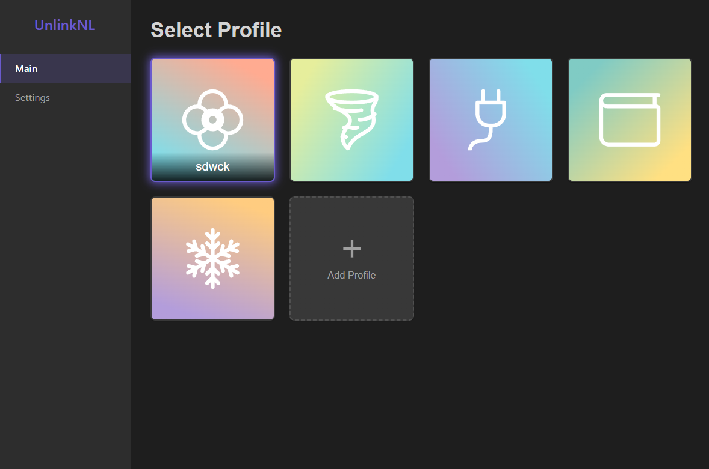
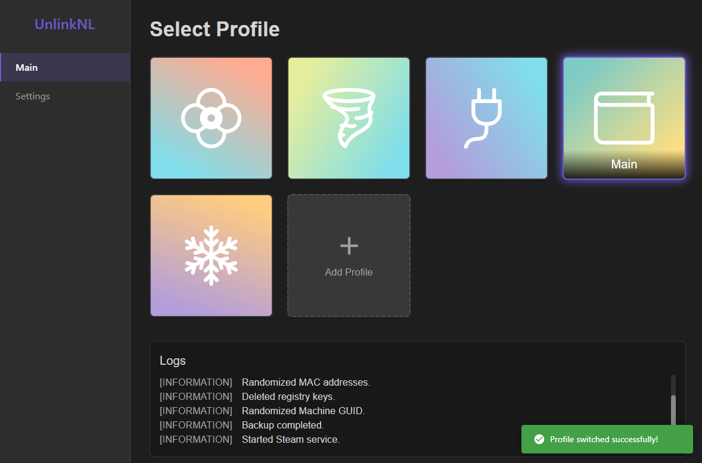
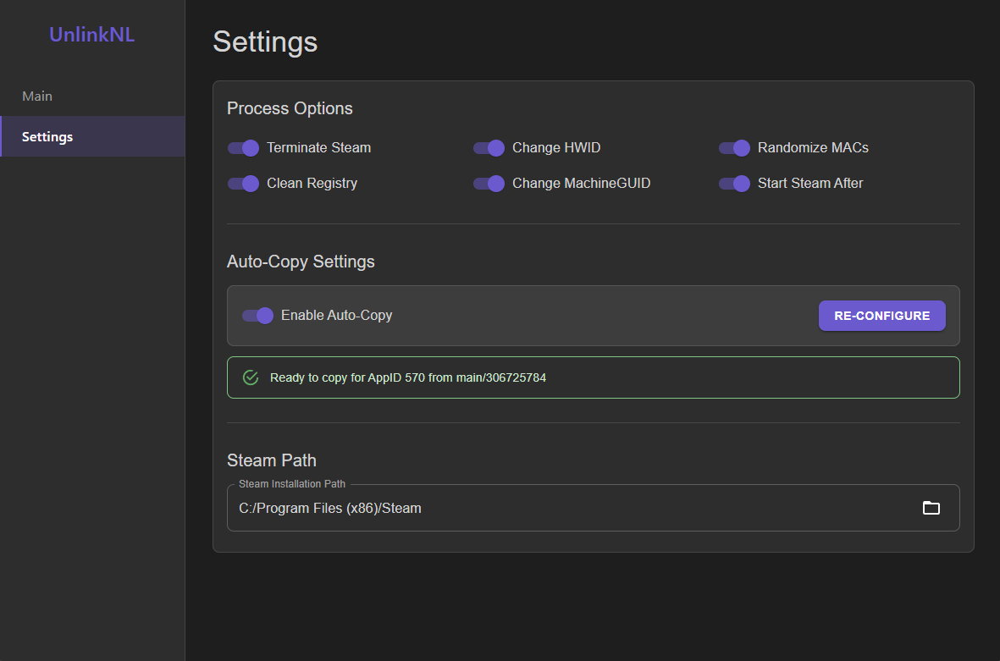

# UnlinkNL 

A powerful desktop application for managing and isolating Steam profiles. 

## Purpose

UnlinkNL is designed for players who want to use multiple Steam accounts while avoiding any hidden links between them.  
This can help prevent hidden matchmaking ratings or other account-based tracking in games like Dota 2 or CS:GO, ensuring a truly fresh start on each profile.

**[► Download Latest Release for Windows](https://github.com/sdwck/UnlinkNL/releases/latest/download/UnlinkNL-win32-x64.zip)**

The application is built on a robust architecture separating the user interface (Electron), the heavy-lifting logic (C# Backend CLI), and external data fetching (Vercel Serverless API).

## Screenshots







## Core Features

*   **One-Click Profile Switching**: Seamlessly switch between Steam profiles. The application handles terminating Steam, swapping profile data, and restarting Steam automatically.
*   **Full Profile CRUD**: Create, read, update, and delete profiles with a user-friendly interface.
    *   Set custom profile names and avatars.
    *   Manage linked Steam accounts within each profile.
    *   Right-click context menu for quick actions (Edit/Delete).
    *   Secure deletion confirmation to prevent mistakes.
*   **System Identifier Spoofing**: At the core of the "unlinking" process, the application can modify:
    *   VolumeID (HWID)
    *   MAC Addresses
    *   Windows MachineGUID
*   **Registry Cleaning**: Automatically cleans relevant Steam keys from the Windows Registry for a complete reset.
*   **Configurable Auto-Copy**: A step-by-step wizard to configure automatic copying of game settings from a reference account to a new profile.
*   **Real-time Logging**: A dedicated log panel shows the output from the backend CLI in real-time during any operation.
*   **Secure API Integration**: All interactions with the Steam Web API are proxied through a secure Vercel serverless function, keeping your API key safe and off the client.

## Technology Stack

The project utilizes a mono-repo structure with three distinct parts:

| Frontend | Backend | Cloud API |
| :--- | :--- | :--- |
| 🖥️ Electron | ⚙️ C# (.NET) | ☁️ Vercel |
| ⚛️ React | 🔧 CLI Tool | ⚡ Node.js |
| 📘 TypeScript | | 📘 TypeScript |
| 🎨 Material-UI | | 🤝 Steam Web API |
| 📦 Webpack | | |

## Project Structure

The repository is organized as a mono-repo to keep all related code in one place.

```
/UnlinkNL/
├── app/                  # The Electron.js frontend application (React + TS)
│   ├── resources/
│   └── src/
├── backend/              # The C# .NET solution for the backend CLI
│   ├── UnlinkNL.Executor.sln
│   └── UnlinkNL.Executor/
└── external-api/           # The serverless function for communicating with Steam API
    └── api/
```

## License

This project is licensed under the MIT License. See the `LICENSE` file for details.